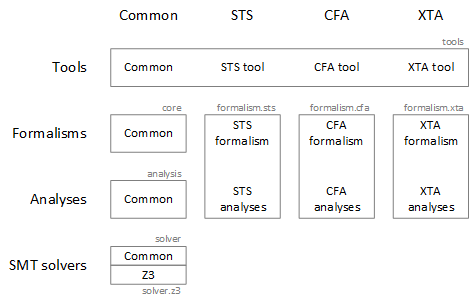

# Architecture

## Overview

Theta can be divided into the following four layers.

* **Formalisms**: The core elements of Theta are the formalisms, which represent models of real life systems (e.g., software, hardware, protocols). Formalisms are usually low level, mathematical representations based on first order logic expressions and graph like structures. Formalisms can also support higher level languages that can be mapped to that particular formalism by a language front-end (consisting of a specific parser and possibly reductions for simplification of the model). The common features of the different formalisms reside in the `hu.bme.mit.theta.core` project (e.g., expressions) and each formalism has its own project starting with the name `hu.bme.mit.theta.formalism.*`. Currently, there are three formalisms: symbolic transition systems (`sts`), control-flow automata (`cfa`) and timed automata (`xta`).
* **Analysis back-end**: The analysis back-end provides the verification algorithms that can formally prove whether a model meets certain requirements. There is an interpreter for each formalism, providing a common interface towards the algorithms (e.g., calculating initial states and successors). This ensures that most components of the algorithms work for all formalisms (as long as they provide the interpreter). The verification algorithms are mostly based on abstraction. The analysis back-end defines various abstract domains, strategies for performing abstraction and refinement, and algorithms built from these components. The common components reside in the `hu.bme.mit.theta.analysis` project (e.g., CEGAR loop) and the formalism-specific modules (e.g., the interpreters) are implemented in the project of the given formalism (`hu.bme.mit.theta.formalism.*`).
* **SMT solver interface and SMT solvers**: Many components of the algorithm rely on satisfiability modulo theories (SMT) solvers. The framework provides a general SMT solver interface in the project `hu.bme.mit.theta.solver` that supports incremental solving, unsat cores, and the generation of binary and sequence interpolants. Currently, the interface is implemented by the SMT solver Z3 in the project `hu.bme.mit.theta.solver.z3`, but it can easily be extended with new solvers.
* **Tools**: Tools are command line (or GUI) applications that can be compiled into a runnable jar file. Tools usually read some input and then instantiate and run the algorithms. Tools are implemented in the project `hu.bme.mit.theta.tools`.

The figure below shows the architecture and the projects (without the `hu.bme.mit.theta` prefix). Each project contains a README.md in its root directory describing its purpose in more detail.

